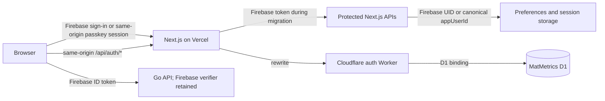

# Better Auth Passkey Migration

## Status and scope

This phase hardens the existing Firebase-to-passkey migration. Firebase remains
available for sign-in, API verification, and the Firestore preferences fallback.
The production Worker defaults keep passkey sign-in, enrolment, and public
passkey-only signup disabled until an operator explicitly enables the pilot.
No production account journey or browser passkey smoke test is claimed by this
document. The read-only production checks and infrastructure audit are recorded
in [Better Auth production readiness](better-auth-production-readiness.md).

The implementation keeps existing Firebase UIDs as canonical MatMetrics user
IDs. It does not remove Firebase, change GitHub Markdown ownership, or migrate
the Go API verifier.

## Authentication and identity model



Existing Firebase identities keep their Firebase UID as `app_users.id`. A
verified Firebase user receives a short-lived, signed, purpose-bound context
for passkey enrolment. Better Auth is linked to that same canonical ID only
after the WebAuthn registration response verifies. Email is an account label;
it is never used to merge identities.

The context reservation table is separate from `app_users` and
`auth_identities`, so abandoned ceremonies do not create incomplete account
mappings. Completion atomically consumes the reservation and writes canonical
identity mappings. A nonce can be reserved and completed only once. A D1
trigger also protects completion and prevents deletion of the final passkey
inside the credential delete statement, including concurrent requests.

The Worker uses Better Auth's own session and credential-management endpoints.
Its wrapper checks ownership and provides a clear error for an attempted final
passkey deletion; the D1 trigger is the concurrent-delete backstop. Better
Auth continues to enforce normal session, ownership, and origin protections.

## Feature flags

Set these flags together for a pilot. UI flags control what the browser offers;
Worker and Vercel server flags decide whether a request is allowed. Server-side
flags are authoritative.

| Capability                                  | Browser flag                            | Server flag                                              | Pilot value                |
| ------------------------------------------- | --------------------------------------- | -------------------------------------------------------- | -------------------------- |
| Firebase sign-in and fallback               | Existing Firebase configuration         | Existing Firebase configuration                          | On                         |
| Passkey sign-in and service JWT issuance    | `NEXT_PUBLIC_BETTER_AUTH_ENABLED`       | Worker `MATMETRICS_PASSKEY_SIGNIN_ENABLED`               | On                         |
| Firebase user adds a passkey                | `NEXT_PUBLIC_PASSKEY_ENROLMENT_ENABLED` | Vercel and Worker `MATMETRICS_PASSKEY_ENROLMENT_ENABLED` | On for selected pilot      |
| Authenticated passkey user adds another key | `NEXT_PUBLIC_PASSKEY_ENROLMENT_ENABLED` | Worker `MATMETRICS_PASSKEY_ENROLMENT_ENABLED`            | On for selected pilot      |
| Public passkey-only account creation        | `NEXT_PUBLIC_PASSKEY_SIGNUP_ENABLED`    | Vercel and Worker `MATMETRICS_PASSKEY_SIGNUP_ENABLED`    | **Off**                    |
| Firebase removal                            | Not applicable                          | Not applicable                                           | **Not part of this phase** |

`NEXT_PUBLIC_BETTER_AUTH_ENABLED` remains the compatibility switch for the
Better Auth client/session path and the registration-context endpoint. Turning
it off hides passkey sign-in and blocks new context issuance, but it does not
remove existing Better Auth accounts or sessions. The Worker
`MATMETRICS_PASSKEY_SIGNIN_ENABLED` flag gates passkey authentication and the
`/token` service-JWT endpoint. Worker registration policy is checked when
options are requested and again after the WebAuthn response is verified, so
changing a server flag during an in-flight ceremony prevents completion.

The production values committed in `workers/matmetrics-auth/wrangler.jsonc`
are safe defaults: all three Worker capabilities are off. Local development
enables sign-in and enrolment but keeps public signup off. Keep public signup
off through this pilot; enabling it would require separate product approval,
recovery readiness, and abuse review.

## Abuse controls and request validation

The Worker applies Cloudflare Rate Limiting bindings to passkey authentication
and registration challenge endpoints. The key is `CF-Connecting-IP`, which
Cloudflare sets from the connection it receives; the Worker does not trust
client-supplied forwarded-IP headers. A direct Worker request is keyed by its
caller IP. A request proxied through Vercel may be keyed by Vercel egress, so
this is a coarse guard for proxied traffic and must not be treated as a
per-browser limit. Use Vercel Firewall on the browser-facing host for the
per-client limit. If the Cloudflare binding is unavailable, the Worker returns
a safe `503` instead of bypassing the limit. The configured Worker limits are
30 sign-in requests and 10 registration requests per minute per key; counters
are local to a Cloudflare location and are approximate, not a globally exact
quota. See [Cloudflare Worker rate limiting](https://developers.cloudflare.com/workers/runtime-apis/bindings/rate-limit/),
[Vercel request headers](https://vercel.com/docs/headers/request-headers),
and [Vercel rewrites](https://vercel.com/docs/routing/rewrites) for the proxy
boundary.

The Vercel registration-context route requires a valid JSON content type,
limits request bodies to 4 KiB, validates a strict schema, requires Firebase
Admin verification for existing-user enrolment, and checks Firebase email
collisions before the optional new-account path. The new-account path remains
disabled by default. Configure Vercel Firewall rate-limit rules on the exact
production host and verify them against production: 30 requests per 60 seconds
per client IP for `GET /api/auth/passkey/generate-authenticate-options`,
`POST /api/auth/passkey/verify-authentication`, and `GET /api/auth/token`; 10
requests per 60 seconds per client IP for
`GET /api/auth/passkey/generate-register-options`,
`POST /api/auth/passkey/verify-registration`, and
`POST /api/passkey/registration-context`. Use the Firewall's rate-limit action
with the over-limit response set to HTTP 429. Vercel overwrites forwarded-IP
headers when it receives the browser request directly; the internal Worker
rewrite then sees Vercel as its network peer. Do not treat the Worker-observed
IP as the original browser IP on that path. See [Vercel Firewall custom
rules](https://vercel.com/docs/vercel-firewall/vercel-waf/custom-rules) and
[Better Auth production readiness](better-auth-production-readiness.md) for
the operator steps. Keep public signup off during the pilot.

Registration failures return safe JSON errors with `no-store` caching where
credentials or registration state are involved. Registration contexts contain
no secret material and expire after ten minutes.

## Recovery policy

Administrator-assisted recovery is **documented only and not implemented**.
Public passkey-only signup stays disabled until a staffed, audited recovery
process exists. The minimum proposed process is:

1. Receive a recovery request through a controlled support channel.
2. Independently verify the person's identity using a documented method that
   does not rely on email access alone.
3. Have two authorized operators approve a one-time enrolment window tied to
   the existing canonical `app_users.id`.
4. Issue a purpose-bound, short-lived, single-use enrolment grant; record the
   request, approvers, canonical ID, timestamps, and outcome in an access
   controlled audit log.
5. Require a new passkey, revoke existing Better Auth sessions, and review or
   revoke any credentials reported lost. Preserve unrelated application data and
   the Firebase identity mapping.

This phase adds no recovery endpoint or administrator credential. Until that
process is designed, staffed, and tested, Firebase remains the migration
fallback for existing users and public passkey-only signup remains off.

## Deployment and rollout

### 1. Prepare the Worker and D1 schema

1. Confirm the auth Worker production D1 binding points at the same database
   used by `workers/matmetrics-data`.
2. Apply migrations through the data Worker, which remains the sole migration
   owner:

   ```bash
   cd workers/matmetrics-data
   npm run migrate:remote
   ```

   Review the pending migration list and cleanup counts first. Migration
   `0004` adds isolated registration claims/completions and the final-passkey
   delete trigger. It deletes all rows from the legacy pre-verification
   reservation table, removes Better Auth identity mappings without a Better
   Auth user, and deletes `app_users` rows left without any provider mapping.
   It does not modify `user_preferences` or GitHub-backed session files. Follow
   the read-only preflight, backup, and verification procedure in
   [Better Auth production readiness](better-auth-production-readiness.md)
   before applying any pending remote migration.

3. Configure the auth Worker secrets `BETTER_AUTH_SECRET` and
   `MATMETRICS_AUTH_CONTEXT_SECRET`. Use a distinct random secret for Better
   Auth and a 32+ character context secret shared with Vercel.
4. Deploy the Worker with production flags off, for example:

   ```bash
   cd workers/matmetrics-auth
   npm ci
   npx wrangler deploy --env production
   ```

   The production config also declares sign-in and registration rate limit
   bindings. Confirm the namespace IDs are unique in the target Cloudflare
   account before the first deployment. Keep Worker secrets out of vars and
   source control. Treat `wrangler.jsonc` as the source of truth for Worker
   vars: a normal deploy reapplies its production flag defaults. If you manage
   Worker vars in the Cloudflare dashboard instead, use Wrangler's
   `--keep-vars` on later deployments and verify the origin, RP ID, issuer, and
   audience as well as the flags.

### 2. Configure Vercel and the same-origin proxy

Set these Vercel server variables to match the production frontend and Worker:

- `CLOUDFLARE_AUTH_WORKER_URL`
- `MATMETRICS_AUTH_CONTEXT_SECRET`
- `MATMETRICS_AUTH_JWKS_URL` (the same-origin `/api/auth/jwks` URL)
- `MATMETRICS_AUTH_ISSUER`
- `MATMETRICS_AUTH_AUDIENCE` (`matmetrics-api` unless intentionally changed)
- `MATMETRICS_PASSKEY_ENROLMENT_ENABLED=false`
- `MATMETRICS_PASSKEY_SIGNUP_ENABLED=false`

The Worker production values for public URL, frontend origin, RP ID, issuer,
and audience must match the deployed hostname exactly. Do not enable passkeys
on arbitrary Vercel preview hosts or wildcard trusted origins. Add and verify
the Vercel Firewall rules described above before the controlled pilot.

### 3. Run the production smoke test with one controlled Firebase account

Use a disposable or explicitly approved test account that already has known
preferences and GitHub-backed sessions. Record its Firebase UID and verify it
matches the canonical MatMetrics ID before beginning. Do not use a real user
account without authorization.

1. Deploy the application and Worker safeguards with all passkey flags off.
2. Verify Firebase sign-in, preferences, and GitHub-backed session history
   still work. Verify Worker `/healthz` and same-origin `/api/auth/jwks`.
3. Enable `NEXT_PUBLIC_BETTER_AUTH_ENABLED=true` in Vercel and set the Worker
   `MATMETRICS_PASSKEY_SIGNIN_ENABLED=true`. Keep public signup off.
4. For the controlled pilot only, set both Vercel and Worker
   `MATMETRICS_PASSKEY_ENROLMENT_ENABLED=true` and set
   `NEXT_PUBLIC_PASSKEY_ENROLMENT_ENABLED=true`. Redeploy/restart the affected
   services so the values are active. Keep
   `MATMETRICS_PASSKEY_SIGNUP_ENABLED=false`,
   `NEXT_PUBLIC_PASSKEY_SIGNUP_ENABLED=false`.
5. Sign in with Firebase, record the canonical user ID, add a passkey, and
   confirm the same ID has both Firebase and Better Auth identity mappings.
   Confirm no second `app_users` row was created.
6. Sign out completely, reload, and sign in with the passkey. Confirm the
   session cookie is host-only, secure, and persists across reloads; confirm
   sign-out invalidates that session.
7. Obtain a Better Auth service JWT. Verify its signature from the same-origin
   JWKS and check issuer, audience, expiry, and canonical `appUserId`.
8. Call a protected Next.js API. Verify the original preferences and original
   GitHub session history are returned under the same canonical user ID.
9. Try a registration-context request without Firebase auth, a tampered or
   expired context, and a public signup request. Confirm each is rejected. Try
   to delete the only passkey and confirm a clear rejection; add a second
   passkey, delete one, and confirm the remaining key still signs in.
10. Record results, deployment versions, canonical ID, and any failures in the
    controlled pilot's change record. Do not claim this smoke test passed until
    it has been executed against the actual deployment and observed.

This procedure is manual in this phase because it requires production
credentials, a configured Vercel/Cloudflare deployment, and a controlled
Firebase test account. Worker-level D1 integration coverage is automated.

### 4. Expand the pilot only after rollback

Start with one account that has known existing data. Exercise rollback for
that account before adding more users. Extend enrolment gradually only after
sign-in, data ownership, session invalidation, and rollback checks pass.
Public signup stays disabled.

## Rollback

1. Revoke the pilot account's Better Auth sessions while the Worker is
   reachable: use the normal sign-out flow, or a reviewed D1 admin operation
   scoped to the exact canonical user ID if sign-out is unavailable. Keep the
   account, identity mappings, and passkey credentials intact.
2. Set `NEXT_PUBLIC_PASSKEY_ENROLMENT_ENABLED=false` and
   `NEXT_PUBLIC_BETTER_AUTH_ENABLED=false` in Vercel to hide the enrolment and
   passkey sign-in UI and block new registration-context issuance.
3. Set Worker `MATMETRICS_PASSKEY_SIGNIN_ENABLED=false` and
   `MATMETRICS_PASSKEY_ENROLMENT_ENABLED=false`; keep signup false. This blocks
   direct Worker passkey sign-in, service JWT issuance, and registration routes.
4. Confirm the pilot account can sign in with its existing Firebase account,
   and confirm preferences and GitHub session records still resolve to the
   original Firebase UID/canonical ID.
5. Leave D1 migrations, identity mappings, Better Auth users, and credentials
   intact during rollback. Do not delete identity rows or rewrite user IDs.
6. Keep the Worker available while any passkey-only account exists. Disabling
   its routes is not a recovery plan for an account that has no Firebase
   identity. Resume only after the issue is understood and the pilot is
   explicitly re-enabled.

Already-issued service JWTs remain valid until their expiration. If an incident
requires immediate invalidation, rotate the Better Auth signing key through a
separately reviewed emergency procedure; this invalidates all currently issued
Better Auth JWTs.

The Go API still trusts Firebase tokens, so this phase does not require a Go
rollback or token migration. Firebase removal and Firestore fallback removal
remain separate future work.

## Verification and known limits

The auth Worker has Cloudflare runtime/D1 integration tests for registration
reservations and completion, tampered/expired/wrong-identity/replayed
contexts, concurrent identity linking, disabled public signup, passkey list and
rename ownership, foreign and final credential deletion, concurrent deletion,
Better Auth session expiry, JWT issuance, JWKS verification, and invalid JWT
claims/signatures. The root `auth-worker:verify` script and CI job run the
Worker tests and typecheck.

The production browser flow, Vercel rewrite/cookie behavior, Firebase Admin
collision check against production, Vercel Firewall rules, and real production
rollback remain manual checks. Cloudflare Worker Rate Limiting is per-location
and approximate; for Vercel-proxied requests it sees the Vercel peer rather
than the original browser. No per-user pilot allowlist exists; enrolment is a
project-wide server flag, so control the pilot through a supervised window and
keep public signup disabled. The final-passkey trigger also blocks cascading
deletion of a Better Auth user that still has exactly one passkey; any future
account-deletion feature must define an ordered deletion path that preserves
the last-key guard for ordinary credential requests. If public signup is ever
considered, review the Firebase email-collision response for account
enumeration and make the response indistinguishable from an available-address
registration before enabling the flag.

Firebase client/Admin dependencies, Firebase sign-in, Firebase token support,
Firestore fallback, GitHub Markdown storage, and the Go Firebase verifier are
intentionally retained. The next architectural phase should move the Go API
to issuer/audience-checked Better Auth JWT verification through JWKS while
retaining Firebase verification during a measured rollback window.
