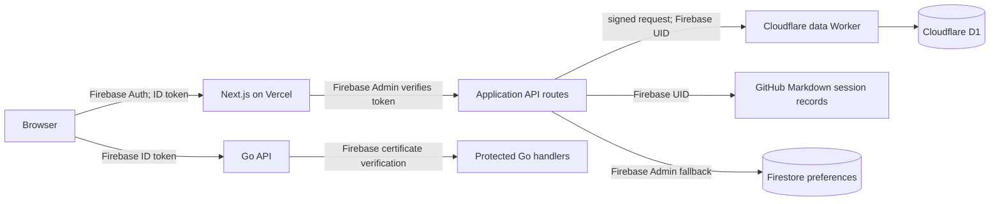
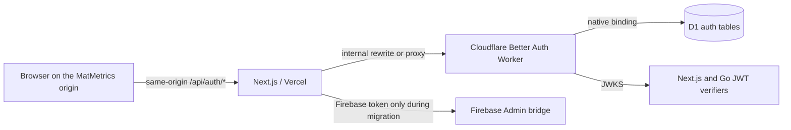

# Better Auth Passkey Migration

## Status

This document records the current architecture and the first implementation
boundary for migrating MatMetrics from Firebase Authentication to Better Auth
with passkeys. Firebase remains active while the transition is built and
validated. No production auth or data migration is performed by this stage.

## Current authentication architecture



- `src/components/auth-provider.tsx` initializes Firebase Auth, supports
  Google, GitHub, and email/password sign-in and registration, and sets
  `user.uid` as the active application user key.
- `src/lib/auth-session.ts` attaches Firebase ID tokens as bearer tokens to
  browser API requests. `src/lib/server-auth.ts` verifies those tokens with
  Firebase Admin and returns a Firebase `DecodedIdToken`.
- Next.js handlers pass `DecodedIdToken.uid` to per-user preferences,
  plugin configuration, GitHub session storage, and the Cloudflare data
  Worker. The Worker authenticates Vercel-to-Worker requests with a timestamped
  HMAC and stores D1 rows under `user_id` values that are currently Firebase
  UIDs.
- Firebase Admin is also the Firestore preferences fallback. The D1 migration
  document keeps that fallback until the D1 cutover is proven.
- The Go API independently verifies Firebase JWTs using Firebase's published
  certificate endpoint and the configured Firebase project ID.
- The D1 schema currently has `user_preferences`,
  `plugin_enabled_overrides`, and `background_jobs`; it has no canonical user
  table or provider identity mapping. GitHub-backed session files are scoped by
  the same existing user key.

## Target topology and origin decision

Better Auth will run in a dedicated Cloudflare Worker with a native D1 binding.
The Worker will not emulate a D1 binding in Vercel or expose D1 administrative
credentials to the Next.js application.



The first production design uses a same-origin `/api/auth/*` proxy from the
Vercel application to the Cloudflare Worker. The browser therefore receives
and sends a host-only session cookie on the MatMetrics application origin; it
does not depend on cross-origin cookies. The proxy preserves the browser
`Origin` header. Better Auth must allow only the configured frontend origin,
and its WebAuthn `origin` and `rpID` must be explicitly aligned with that
frontend hostname. Better Auth's current passkey guide describes RP IDs as
bounded by the effective domain, and its Cloudflare Worker fixture uses a
separate worker listener while setting the application URL as `baseURL`.

For local development, Next.js uses `http://localhost:9002`, the auth Worker
uses a different local port, and the RP ID is `localhost`. For production,
the RP ID must match the actual Vercel application hostname or a controlled
custom domain. Arbitrary Vercel preview hostnames cannot safely share one
passkey RP ID; passkey sign-in should be limited to production and a stable,
explicit preview hostname unless a preview is configured with its own RP ID
and isolated credentials. Do not use wildcard trusted origins or broaden a
cookie to unrelated domains.

This proxy topology keeps the Cloudflare/Vercel split viable without
cross-origin session cookies or custom D1 transport code. Before enabling
production passkeys, verify the deployed hostname, Better Auth's effective
WebAuthn origin/RP ID handling behind the proxy, and Vercel rewrite behavior in
each environment. If Vercel cannot preserve the required origin and cookie
behavior, the clean fallback is to put both the frontend and auth endpoint
under a controlled custom domain with the auth Worker on a sibling hostname;
do not weaken origin validation to make the current `.vercel.app` hostname
work.

## Identity migration strategy

The canonical MatMetrics identity will be separate from an authentication
provider identity:

```text
app_users(id)
  └── auth_identities(app_user_id, provider, provider_subject)
```

Existing application identifiers are preserved: while migrating a Firebase
account, its canonical `app_users.id` remains its current Firebase UID. The
mapping records that UID as a Firebase identity, and the Better Auth identity
is linked to that same canonical row. This avoids rewriting existing D1 rows,
GitHub Markdown paths, preference keys, or session caches. New users receive a
new opaque canonical ID. No mapping is made by email alone; a migration context
must be issued only after Firebase Admin verifies the authenticated UID.

Application authorization will use a provider-neutral principal with both
the external subject and the canonical MatMetrics user ID. During the bridge,
Firebase tokens resolve to the existing UID-backed canonical ID. Better Auth
JWTs will identify the same canonical ID for migrated accounts. Firebase stays
available until both identity paths have exercised the same protected
resources and rollback has been validated.

## Onboarding and recovery decisions

The existing product offers public Firebase registration, so the current
product behavior is evidence for self-service onboarding. New passkey
registration can retain an email as a unique account label, but the email will
not be treated as proof of ownership and there will be no email recovery flow.
Before enabling this path, registration must reject addresses already present
in Firebase and direct those users through Firebase-authenticated passkey
enrolment. The database uniqueness constraint prevents duplicate Better Auth
accounts. No social providers or password credentials are part of the target.

Recovery is based on registering more than one passkey, synced passkey
providers, or hardware security keys. Initial administrative recovery is a
controlled, audited, one-time enrolment process after independently verifying
the user and preserving the existing canonical ID. It is not an email-only
reset and must not become a permanent master credential. A user with no
registered passkey and no verifiable existing Firebase session has no
self-service recovery in the initial design.

## Staged implementation

1. **Groundwork:** record this architecture; add canonical user and identity
   mapping support without removing Firebase or changing existing user IDs.
2. **Better Auth infrastructure:** add the Cloudflare auth Worker, direct D1
   binding, versioned schema migration, passkey and JWT plugins, and the
   same-origin Vercel proxy. Keep Firebase login and APIs working.
3. **Enrolment and management:** mint short-lived, purpose-bound registration
   contexts only after Firebase token verification; link the passkey identity
   to the existing canonical user; add passkey list/add/rename/delete UI.
4. **Dual authentication:** accept Firebase and Better Auth JWT/session
   identities at the Next.js boundary while preserving the same canonical
   user ID. Make passkey login the primary UI after local and preview checks.
5. **Go/API migration:** move Go verification to issuer/audience-checked JWTs
   from the Better Auth JWKS endpoint; retain Firebase verification through
   the rollback window.
6. **Firebase removal:** remove Firebase Auth/Admin only after identity and
   data ownership checks pass in every environment. Keep the existing
   preference fallback and Firebase bridge until that checkpoint.

## First-slice implementation details

The current code implements an additive migration boundary. Migration
`0003_better_auth_identity.sql` adds `app_users`, `auth_identities`, and
single-use `auth_registration_contexts`, plus Better Auth's `user`, `session`,
`account`, and `verification` tables, the passkey table, and the JWT plugin's
`jwks` table. The migration leaves existing preference, plugin, job, and
GitHub-backed session identifiers unchanged. Better Auth uses the same D1
database through its own Cloudflare binding; only the existing data Worker
applies D1 migrations.

An existing user enrols by requesting a short-lived context from
`/api/passkey/registration-context` while presenting a Firebase bearer token.
Next.js verifies that token with Firebase Admin and derives the current Firebase
UID as the canonical MatMetrics ID. The signed context expires after ten
minutes, contains a random nonce, and is persisted by the auth Worker when
registration options are requested. The Worker rejects a replay or identity
mismatch, verifies the WebAuthn response, creates the Better Auth user with the
same ID, consumes the nonce, then stores the passkey and creates a normal
Better Auth session. The database identity mapping prevents either provider
subject from being claimed by a different MatMetrics user.

New self-service registration is retained because the current Firebase UI
already allows public registration. The context issuer checks for an existing
Firebase email and requires those users to enrol from their authenticated
Firebase session. For new Better Auth users, email is only a unique account
label: it is not verified, cannot be used for recovery, and does not link
accounts. The Worker also rejects a label already attached to a different
Better Auth user. Password and social providers remain disabled.

After passkey sign-in, the browser uses a normal Better Auth cookie session.
When a protected API call needs a bearer credential, the client requests a
short-lived JWT from Better Auth. Next.js verifies its EdDSA signature against
the same-origin `/api/auth/jwks`, then checks issuer, audience, expiration, and
that `sub` equals the canonical `appUserId`. Firebase ID tokens remain accepted
at the Next.js boundary during this transition. The Go API still uses its
Firebase verifier and is a later migration phase.

Recovery currently relies on registering at least two passkeys, synced
passkeys, or a hardware security key. A user who loses all passkeys can still
use their existing Firebase account during this migration. New passkey-only
accounts have no self-service recovery; controlled administrative recovery
would require independent identity verification and a one-time, audited
enrolment process that preserves the canonical ID. No email-only reset or
permanent master credential is implemented.

## Environment and deployment

The Vercel app uses these server-side settings: `CLOUDFLARE_AUTH_WORKER_URL`
for the rewrite destination, `MATMETRICS_AUTH_CONTEXT_SECRET` to mint
registration contexts, `MATMETRICS_AUTH_JWKS_URL` for local JWT verification,
and `MATMETRICS_AUTH_ISSUER` / `MATMETRICS_AUTH_AUDIENCE` matching the auth
Worker. `NEXT_PUBLIC_BETTER_AUTH_ENABLED` controls the passkey UI and client
session integration. `BETTER_AUTH_SECRET` exists only in Cloudflare.

The Worker requires `BETTER_AUTH_SECRET` and a copy of
`MATMETRICS_AUTH_CONTEXT_SECRET`, plus `MATMETRICS_AUTH_PUBLIC_URL`,
`MATMETRICS_AUTH_FRONTEND_ORIGIN`, `MATMETRICS_AUTH_RP_ID`,
`MATMETRICS_AUTH_ISSUER`, and `MATMETRICS_AUTH_AUDIENCE`. Local defaults use
`http://localhost:9002` and RP ID `localhost`. Production values must exactly
match the deployed frontend origin/hostname. Keep passkey UI disabled on
arbitrary Vercel previews; use a stable preview hostname and isolated D1/auth
secrets if preview enrolment is needed.

For local setup, run `npm run migrate:local` in `workers/matmetrics-data`, then
start the auth Worker and Next.js app. For deployment, apply the additive
migration through the existing D1 migration owner before deploying the auth
Worker. Do not run migrations from application startup.

## Rollback and remaining work

For existing users, Firebase accounts and their canonical UIDs remain intact;
disable the passkey UI and resume Firebase login if the new path must be
paused. The D1 schema is additive and can remain in place during rollback.
Keep the auth Worker and Better Auth tables available while any new passkey-only
accounts exist: those accounts have no Firebase identity to fall back to.
Before disabling the Worker, export or migrate their identity and passkey
access through a separately planned recovery process.

This slice does not remove Firebase client/Admin packages or the Firebase sign
in UI. Next.js still accepts Firebase bearer tokens, Firebase Admin still
issues enrolment contexts and provides Firestore fallback, and the Go API
still verifies Firebase JWTs. A localhost ceremony was exercised with
Chromium's virtual authenticator: registration, sign-out, passkey sign-in,
Better Auth session creation, JWT issuance, and local JWKS verification all
completed successfully. The test minted a short-lived context directly for a
throwaway local account because this environment has no Firebase credentials;
it did not exercise Firebase Admin's existing-email collision check.

Remaining phases are to test the production origin/cookie rewrite and real
Firebase-authenticated enrolment in a configured deployment, move Go API
verification to Better Auth JWKS while retaining Firebase through a rollback
window, then remove Firebase only after all user/data ownership checks pass.

## Current official guidance consulted

- Better Auth Passkey plugin: `@better-auth/passkey`, paired server/client
  plugins, pre-auth registration `requireSession`/`resolveUser` context,
  passkey management endpoints, and browser authenticator emulator guidance.
- Better Auth JWT plugin: session cookies remain the browser session; use the
  plugin token and JWKS endpoint for services, verify issuer and audience, and
  refresh the key set on an unknown `kid`.
- Better Auth Cloudflare Worker fixture: `betterAuth({ database: env.DB })`
  uses the Worker D1 binding directly.
- Better Auth Next.js integration: current Next.js integration mounts handlers
  under `/api/auth/[...all]`; Next.js 16 uses `proxy` rather than
  `middleware` for routing checks.
- Repository-installed Next.js 16.3.4 guidance under
  `node_modules/next/dist/docs/` is the source of truth for any Next.js code.

The upstream Better Auth documentation and Cloudflare fixture were inspected
from the current `better-auth` repository on 2026-10-03. The deployed RP ID,
origin, cookie, and preview behavior still require environment-specific
verification before production enablement.
